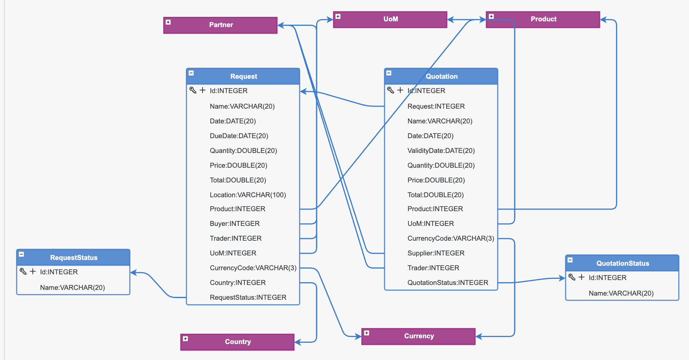

# codbex-rfqs
RFQs Management Application

### Model

### Application

#### Launchpad

#### Management

### Infrastructure

#### Build

	docker build -t codbex-rfqs:1.0.0 .

#### Run

	docker run --name codbex-rfqs -d -p 8080:8080 codbex-rfqs:1.0.0

#### Clean

	docker rm codbex-rfqs